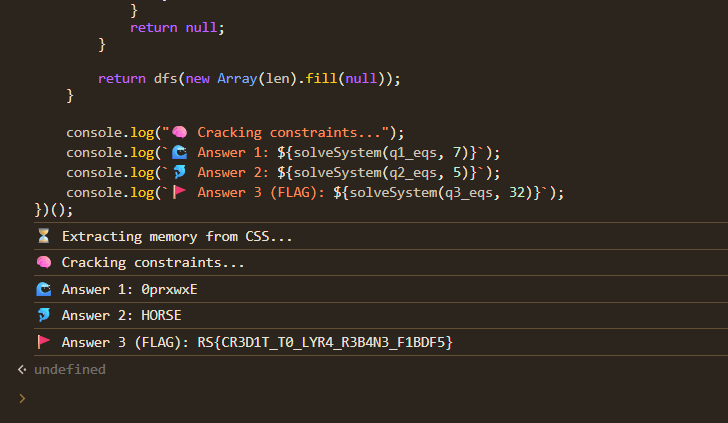

# CTF Writeup: Cascading the Seven Seas

**Category:** Web / Reverse Engineering  
**Source:** [https://css.ctf.ritsec.club/](https://css.ctf.ritsec.club/)

## 1. Overview
Các tính năng của CSS hiện đại như `@property`, `calc()`, và bộ chọn `:has()` được sử dụng để xây dựng thanh ghi (registers), bộ nhớ (memory), và chu kỳ xung nhịp (clock cycles) thông qua CSS Animations.

Nhiệm vụ của người chơi là nhập đúng đáp án cho 3 câu hỏi thông qua bàn phím ảo trên màn hình để nhận được Flag.

## 2. Initial Analysis
Khi kiểm tra mã nguồn HTML/CSS, ta có thể nhận thấy cấu trúc của máy ảo này:
* **Clock:** Được điều khiển bởi animation `@keyframes anim-play` lặp lại liên tục để thay đổi trạng thái của biến `--clock`.
* **Memory:** Hàng ngàn CSS variables từ `--m0` đến `--m1567`, `--m8192`... đóng vai trò là các ô nhớ RAM. Chứa sẵn bytecode của chương trình.
* **Registers:** Các biến như `--AX`, `--BX`, `--CX`, `--IP` (Instruction Pointer), `--SP` (Stack Pointer).
* **Input:** Sử dụng selector `:has(button:nth-child(n):hover:active)` để ánh xạ phím bấm vào biến `--keyboard`.

Bằng cách đọc các giá trị ASCII được khởi tạo trong bộ nhớ, ta thấy 3 câu hỏi được in ra màn hình:
1. `\n1. Which ocean is the largest?:` (Độ dài 7 ký tự)
2. `\n2. Name an aquatic mammal:` (Độ dài 5 ký tự)
3. `\n3. What's the flag?:` (Độ dài 32 ký tự)

## 3. Reverse Engineering the Logic
Khi trace đoạn bytecode thực thi việc kiểm tra input (nằm quanh khu vực `m434` đến `m497`), logic kiểm tra được thiết kế dưới dạng một vòng lặp so sánh các phương trình toán học.

Dịch ngược mảng dữ liệu cấu trúc (mỗi phần tử 8 bytes), ta rút ra được phương trình ràng buộc (constraint) cho các ký tự nhập vào như sau:
```c
(input[offset1] + input[offset2]) ^ input[offset0] == expected_result
```

Các phương trình này được lưu trữ tại:
* **Câu 1:** Từ bộ nhớ `m1136` (7 phương trình)
* **Câu 2:** Từ bộ nhớ `m1056` (5 phương trình)
* **Câu 3:** Từ bộ nhớ `m800` (32 phương trình)

Vì các phương trình này đan chéo nhau (ký tự này phụ thuộc vào ký tự kia), việc giải tay hoặc mò mẫm là bất khả thi. Ta cần dùng thuật toán để giải hệ phương trình này.

## 4. Exploitation (The JavaScript Solver)
Thay vì trích xuất bộ nhớ ra ngoài và dùng Python/Z3, cách thanh lịch và nhanh nhất là viết một script JavaScript chạy thẳng trên Console của trình duyệt. 

Script dưới đây sẽ tự động quét CSS để lấy trạng thái bộ nhớ hiện tại, parse các phương trình, và dùng thuật toán DFS (Depth-First Search) kết hợp với kỹ thuật Constraint Propagation (Lan truyền ràng buộc) để tìm ra chuỗi ký tự hợp lệ.

### Payload:
Mở DevTools (F12) -> Console và chạy đoạn code sau:

```javascript
(function() {
    console.log("⏳ Extracting memory from CSS...");
    
    // 1. Extract memory values from CSS variables
    let memory = new Array(2000).fill(0);
    let styles = document.querySelectorAll('style');
    let regex = /@property\s+--m(\d+)\s*\{[^}]*initial-value:\s*(-?\d+)/g;
    
    styles.forEach(style => {
        let match;
        while ((match = regex.exec(style.innerHTML)) !== null) {
            memory[parseInt(match[1])] = parseInt(match[2]);
        }
    });

    // 2. Parse constraints: (input[o1] + input[o2]) ^ input[o0] == expected
    function getEquations(startOffset, numEquations) {
        let eqs = [];
        for (let i = 0; i < numEquations; i++) {
            let base = startOffset + i * 8;
            eqs.push([
                memory[base],      // Offset 0
                memory[base + 2],  // Offset 1
                memory[base + 4],  // Offset 2
                memory[base + 6]   // Expected
            ]);
        }
        return eqs;
    }

    let q1_eqs = getEquations(1136, 7);
    let q2_eqs = getEquations(1056, 5);
    let q3_eqs = getEquations(800, 32);

    // 3. DFS Solver with Constraint Propagation
    function solveSystem(eqs, len) {
        function propagate(f) {
            let changed = true;
            while (changed) {
                changed = false;
                for (let eq of eqs) {
                    let [o0, o1, o2, exp] = eq;
                    let v0 = f[o0], v1 = f[o1], v2 = f[o2];
                    
                    if (v0 !== null && v1 !== null && v2 !== null) {
                        if (((v1 + v2) ^ v0) !== exp) return null; // Invalid state
                    } else if (v0 !== null && v1 !== null && v2 === null) {
                        let val2 = (exp ^ v0) - v1;
                        if (val2 < 32 || val2 > 126) return null;
                        f[o2] = val2; changed = true;
                    } else if (v0 !== null && v2 !== null && v1 === null) {
                        let val1 = (exp ^ v0) - v2;
                        if (val1 < 32 || val1 > 126) return null;
                        f[o1] = val1; changed = true;
                    } else if (v1 !== null && v2 !== null && v0 === null) {
                        let val0 = (v1 + v2) ^ exp;
                        if (val0 < 32 || val0 > 126) return null;
                        f[o0] = val0; changed = true;
                    }
                }
            }
            return f;
        }

        // Optimize search order by variable frequency
        let freqs = new Array(len).fill(0);
        eqs.forEach(eq => { freqs[eq[0]]++; freqs[eq[1]]++; freqs[eq[2]]++; });
        let order = Array.from({length: len}, (_, i) => i).sort((a, b) => freqs[b] - freqs[a]);

        function dfs(f) {
            if (f.every(x => x !== null)) return String.fromCharCode(...f);
            
            let nextIdx = order.find(i => f[i] === null);
            for (let c = 32; c <= 126; c++) {
                let newF = [...f];
                newF[nextIdx] = c;
                let propF = propagate(newF);
                if (propF !== null) {
                    let res = dfs(propF);
                    if (res) return res;
                }
            }
            return null;
        }

        return dfs(new Array(len).fill(null));
    }

    console.log("🧠 Cracking constraints...");
    console.log(`🌊 Answer 1: ${solveSystem(q1_eqs, 7)}`);
    console.log(`🐬 Answer 2: ${solveSystem(q2_eqs, 5)}`);
    console.log(`🚩 Answer 3 (FLAG): ${solveSystem(q3_eqs, 32)}`);
})();
```

## 5. Get flag
