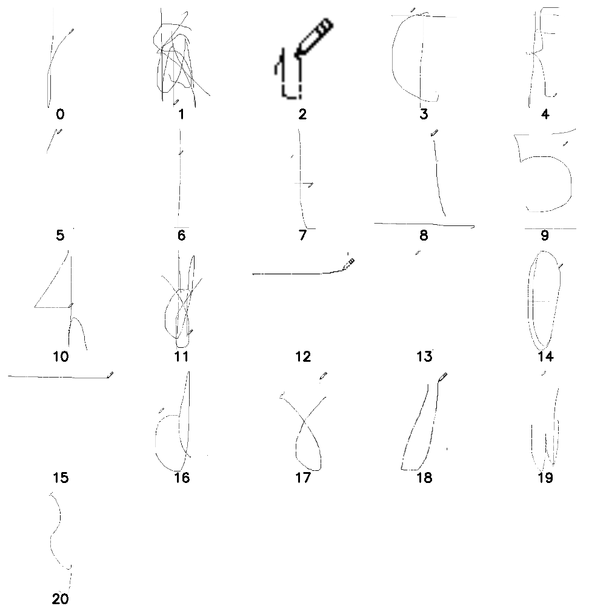

# Cursed Calligraphy - KashiCTF Writeup

## Challenge Description

> In the eternal city of Kashi, knowledge flows not just through words—but through motion.
> 
> An intern from the institute's media cell was tasked with digitizing archival scripts using simple tools. However, something feels off. The uploaded logs contain hundreds of records, but only one holds the truth.
> 
> Rumor has it that the flag was never typed… only drawn.
> 
> Your task is to sift through the noise, uncover the correct archive, and reconstruct what lies hidden within the strokes.
> 
> In Kashi, even chaos follows a pattern.

**Flag format:** `kashiCTF{...}`

## Solution

### Step 1: Finding the Correct Archive

We're given an Excel file `nariyal.xlsx` containing 100 records of uploaded files. Each record has:
- ID, Department, Filename, Uploader, Status, Drive Link, Notes

Looking through the data, we find one entry with a unique note:

```python
import pandas as pd

df = pd.read_excel('nariyal.xlsx')
target = df[df['Notes'] == 'This is the one']
print(target)
```

**Result:**
- ID: 42
- Department: Input Lab  
- Filename: `paint_capture_review.mp4`
- Notes: "This is the one"
- Drive Link: https://drive.google.com/file/d/1nIw_Mb6IBGGQNaiqqDHPeJL1oSwPBItx/view

The "Input Lab" department and the hint "the flag was never typed… only drawn" confirms this is our target.

### Step 2: Analyzing the Video

Download the MP4 file:
```bash
gdown "https://drive.google.com/file/d/1nIw_Mb6IBGGQNaiqqDHPeJL1oSwPBItx/view" --fuzzy
```

The video shows a drawing being created with digital ink strokes. The strokes overlap messily, making the final result very hard to read directly.

**Video properties:**
- Duration: ~72 seconds (2170 frames at 30 FPS)
- Resolution: 712x542
- Content: Hand-drawn text using a digital pen/cursor

### Step 3: Extracting Stroke Data

The key insight is that "the flag was never typed… only drawn" - we need to analyze the **stroke order**, not just the final result.

We extract strokes by:
1. Analyzing frame-by-frame changes to detect when new pixels appear
2. Segmenting the video based on temporal gaps (pauses in drawing)
3. Isolating strokes drawn in each time window

```python
# Detect new strokes between frames
gray_start = cv2.cvtColor(frame_start, cv2.COLOR_BGR2GRAY)
gray_end = cv2.cvtColor(frame_end, cv2.COLOR_BGR2GRAY)

_, binary_start = cv2.threshold(gray_start, 200, 255, cv2.THRESH_BINARY_INV)
_, binary_end = cv2.threshold(gray_end, 200, 255, cv2.THRESH_BINARY_INV)

# Extract only NEW strokes
new_strokes = cv2.bitwise_and(binary_end, cv2.bitwise_not(binary_start))
```

### Step 4: Temporal Segmentation

By analyzing gaps in drawing activity, we identified 21 time segments where characters were drawn:

| Segment | Frames | Character |
|---------|--------|-----------|
| 0 | 0-50 | k |
| 1 | 50-270 | a (+ overlapping strokes) |
| 2 | 270-320 | (small marks) |
| 3 | 320-480 | C |
| 4 | 480-630 | F |
| 5-8 | 630-1010 | { |
| 9 | 1010-1200 | 5 |
| 10 | 1200-1310 | 4 |
| 11 | 1310-1490 | N |
| 12-13 | 1490-1590 | (connecting strokes) |
| 14 | 1590-1710 | 0 |
| 15 | 1710-1760 | (horizontal line) |
| 16 | 1760-1870 | d |
| 17 | 1870-1900 | y |
| 18 | 1900-1960 | (small strokes) |
| 19 | 1960-2080 | W |
| 20 | 2080-2170 | } |

### Step 5: Creating a Grid Visualization

To make manual reading easier, we created a grid showing each isolated segment:

```python
# Create 5-column grid of all segments
# Each cell shows the strokes drawn in that time window
# This allows us to read individual characters clearly
```



### Step 6: Reading the Flag

Looking at the grid and carefully reading each character from the hand-drawn strokes, we can identify:
- The flag starts with `kashiCTF{` (as expected from the format)
- Inside the braces: `1t_i5_h4rd_t0_dr4w` (in leetspeak/1337speak)
- The closing brace `}`

The messy overlapping in segment 1 contains the "ashi" part, combined with segment 0's "k" to form "kashi".

### Leetspeak Decoding

The content inside the braces uses leetspeak substitutions:
- `1` = `I`
- `t` = `t`
- `i` = `i`
- `5` = `s`
- `h` = `h`
- `4` = `a`
- `r` = `r`
- `d` = `d`
- `0` = `o`
- `w` = `w`

**Decoded message:** "It is hard to draw"

This is a meta-joke about the challenge itself - the cursed, overlapping calligraphy literally demonstrates that it IS hard to draw (and read)!

## Flag

```
kashiCTF{1t_i5_h4rd_t0_dr4w}
```